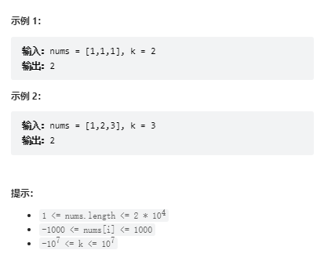

# 题目
给你一个整数数组 nums 和一个整数 k ，请你统计并返回 该数组中和为 k 的连续子数组的个数 。


# coding

```java
class Solution {
    /**
        数组中连续子数组的个数===》前缀和
     */
    public int subarraySum(int[] nums, int k) {
        int ans = 0;
        Integer preSum = 0;
        // val-出现的次数
        Map<Integer,Integer> preSumToCountMap = new HashMap<>();
        preSumToCountMap.put(0, 1);
        for(int i = 0; i <= nums.length - 1; i++){
            preSum += nums[i];
            // 相减的问题
            if(preSumToCountMap.containsKey(preSum- k)){
                Integer count = preSumToCountMap.get(preSum- k);
                ans = ans + count;
            }
            preSumToCountMap.put(preSum, preSumToCountMap.getOrDefault(preSum,0) + 1);
        }
        return ans;
    }
}
```


# 总结
 
1. [leetCode325.和等于k的最长子数组长度](./leetCode325.%20和等于%20k%20的最长子数组长度.md)和这题是一样的
2. 主要的难点就是和325不一样的地方就是，map中放的key和value不一样，这个是放的前缀和+出现的次数
