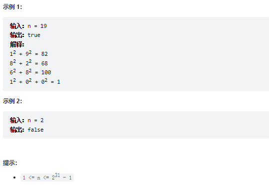

# 题目
编写一个算法来判断一个数 n 是不是快乐数。

「快乐数」 定义为：

对于一个正整数，每一次将该数替换为它每个位置上的数字的平方和。
然后重复这个过程直到这个数变为 1，也可能是 无限循环 但始终变不到 1。
如果这个过程 结果为 1，那么这个数就是快乐数。
如果 n 是 快乐数 就返回 true ；不是，则返回 false 。

 


# coding
```java
class Solution {
    // 因为会存在循环的情况，所以使用hash去判断就好了
    public boolean isHappy(int n) {
        Set<Integer> set = new HashSet<>();

        while(true){
            // 获取拆分后的数
            n = getSum(n);   
            if(n == 1){
                return true;
            }
            // 由题可知循环的时候就是重复了没有快乐值
            if(set.contains(n)){
                return false;
            }
            set.add(n);    
        }
    }

    /**
    拆分数并求和
     */
    public int getSum(int n){
        int res = 0;
        while(n > 0){
            int temp = n % 10;
            res += temp * temp;
            n = n / 10;
        }
        return res;
    }
}

```


# 总结
1. 这道题咋一眼看以为是一到数学题，其实不是
2. 题目中加粗的字体说了当我们的值重复的时候说明就没有快乐数了
3. 所以我们在这里可以判断容器（使用hashSet）中是不是已经由拆分后的数来判断就行了，同时判断有没有到达快乐数的值