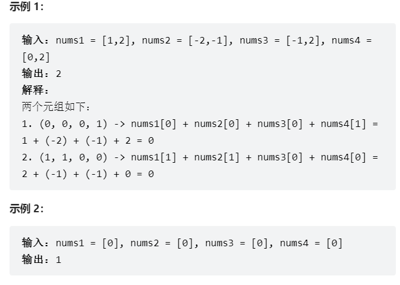

# 题目

给你四个整数数组 nums1、nums2、nums3 和 nums4 ，数组长度都是 n ，请你计算有多少个元组 (i, j, k, l) 能满足：

0 <= i, j, k, l < n
nums1[i] + nums2[j] + nums3[k] + nums4[l] == 0


# coding

```java
class Solution {
    // 使用map缓存两两数组的排列
    public int fourSumCount(int[] nums1, int[] nums2, int[] nums3, int[] nums4) {
        // key 值 ；value 出现的次数
        Map<Integer, Integer> map = new HashMap<>();
        int lengthNums =  nums1.length;
        int res = 0;
        for(int num1 : nums1){
            for(int num2 : nums2){
                int sum = num1 + num2;
                map.put(sum, map.getOrDefault(sum, 0) + 1);
            }
        }


        for(int num3 : nums3){
            for(int num4 : nums4){
                int sum = num3 + num4;
                int target = 0 - sum;
                res +=  map.getOrDefault(target, 0);
            }
        }
        return res;
    }
}

```

# 总结
1. 使用map做缓存，两两数组进行求和组合存放到map中
2. 这里有一个点，我们确实要考虑到时间复杂度的问题，但是就这种题来说，O（n^2）也是ok 的


