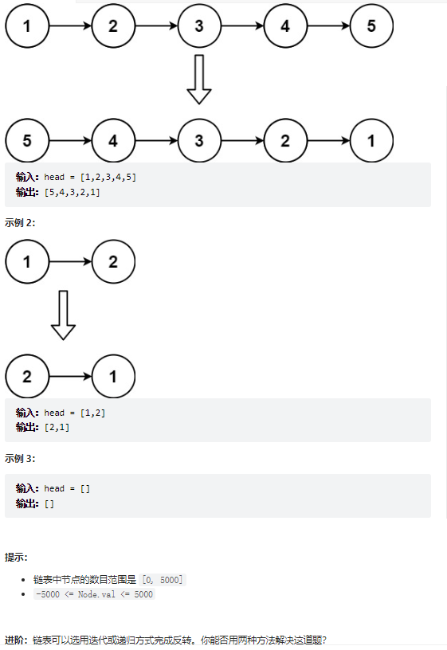
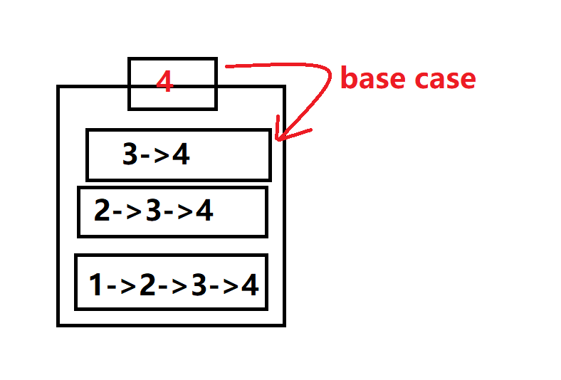

# 题目
给你单链表的头节点 head ，请你反转链表，并返回反转后的链表。


# coding
1. 迭代
```java
    // 迭代
    public ListNode reverseList(ListNode head) {
        ListNode pre = null;
        ListNode cur = head;
        while(cur != null){
            ListNode next = cur.next;
            cur.next = pre;
            pre =cur;
            cur = next;      
        }
        return pre;
    }
```


2. 
```java
   // 递归(e.g. 1->2->3->4)
    public ListNode reverseList(ListNode head) {
        // base case
        if(head == null || head.next == null){
            return head;
        }
        ListNode pre = head;
        ListNode last = reverseList(head.next);
        // 建议跟一下debug好好的理解一下递归，这里head是3（因为bese case 返回的是4之直接赋值给next，然后到下面的栈就是3-->4）
        head.next.next = pre;
        pre.next = null;
        return last;

    }
```
# 总结

- 1 迭代
   1. 对于迭代其实每次都是反转一个节点，然后用临时指针，记录下一个节点用于后移使用


- 2 递归
  1. 递归易错点
     1. 最后的base case，并不是继续下面的逻辑，而是真正的return，向这题最后的base case就是直接给last赋值，然后后面所有的last都是4。真正每轮递归该做的事是别的堆栈在做的，base case 并不参与
     2. 如图对递归的理解
 