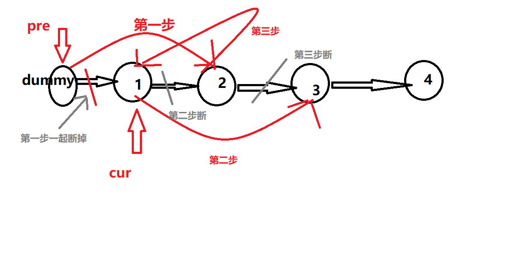
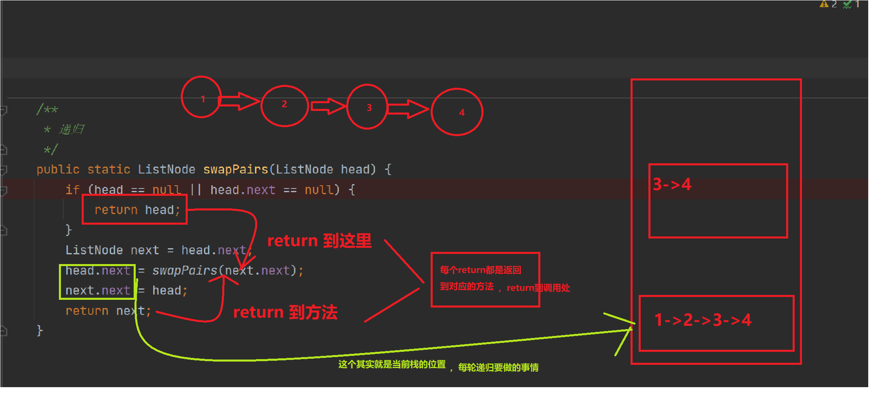

# 题目
给你一个链表，两两交换其中相邻的节点，并返回交换后链表的头节点。你必须在不修改节点内部的值的情况下完成本题（即，只能进行节点交换）。


# coding
- 一：使用三指针（不停移动指针）
```java
/**
 * Definition for singly-linked list.
 * public class ListNode {
 *     int val;
 *     ListNode next;
 *     ListNode() {}
 *     ListNode(int val) { this.val = val; }
 *     ListNode(int val, ListNode next) { this.val = val; this.next = next; }
 * }
 */
class Solution {
    /**
     三指针
     */
    public ListNode swapPairs(ListNode head) {
        ListNode dummy = new ListNode(-1);
        dummy.next = head;
        ListNode pre = dummy;
        ListNode cur = dummy.next;
        while(cur != null && cur.next != null){
            ListNode next =  cur.next;
            pre.next = next;
            cur.next = next.next;
            next.next = cur;
            // 这时候cur已经交换过后到了第二个位置
            pre = cur;
            cur = cur.next;
        }

        return dummy.next;
    }
}
```

- 二：使用递归的方式
```java
/**
 * Definition for singly-linked list.
 * public class ListNode {
 *     int val;
 *     ListNode next;
 *     ListNode() {}
 *     ListNode(int val) { this.val = val; }
 *     ListNode(int val, ListNode next) { this.val = val; this.next = next; }
 * }
 */
class Solution {
    /**
        递归
     */
    public ListNode swapPairs(ListNode head) {
        // base case
        if(head == null || head.next == null){
            return head;
        }
        ListNode next = head.next;
        // 递归（并且head指向next）
        head.next = swapPairs(next.next);
        // 每轮递归要干的事情（等价于head.next.next = head[这里需要注意的点就是，当我们最后一次递归的时候，head是null，所以可能会有空指针异常，所以使用next作为了临时记录点]）
        next.next = head;
        return next;
    }
}
```


# 总结
- **1.指针总结**
  - 1.由图我们难看出启用的过程
  - 2.由这题断指针的顺序，和重新指向的顺序我们可以知道，我们<font color="red">必须先断前面的链表指针</font>，然后再去断后面的链表指针，这样就避免了我到后面交换的时候找不到后面节点指向的下一个地址
  

- **2.递归法**
  - 递归总结三部曲
  1. 终止条件
  2. 返回上一层的是什么
  3. 每轮递归需要干嘛（下面的图是为了方便理解，在做题时不建议一一压栈去想，我的普通的大脑压不动）
以本题为例子，详解递归，如下图
