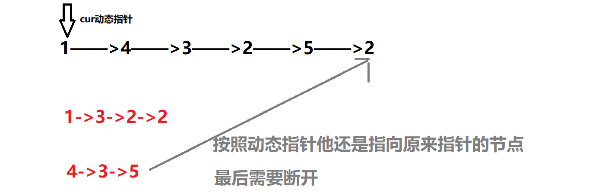

# 题目

给你一个链表的头节点 head 和一个特定值 x ，请你对链表进行分隔，使得所有 小于 x 的节点都出现在 大于或等于 x 的节点之前。

你应当 保留 两个分区中每个节点的初始相对位置。


# coding
```java
/**
 * Definition for singly-linked list.
 * public class ListNode {
 *     int val;
 *     ListNode next;
 *     ListNode() {}
 *     ListNode(int val) { this.val = val; }
 *     ListNode(int val, ListNode next) { this.val = val; this.next = next; }
 * }
 */
class Solution {
    // 使用两个虚拟指针节点
    public ListNode partition(ListNode head, int x) {
        ListNode dummySmall = new ListNode(-1);
        ListNode dummyBig = new ListNode(-2);
        ListNode smallCur = dummySmall;
        ListNode bigCur = dummyBig;
        ListNode cur = head;
        while(cur != null){
            if(cur.val < x){
                smallCur.next = cur;
                smallCur = smallCur.next;
            }else{
                bigCur.next = cur;
                bigCur = bigCur.next;
            }
            cur = cur.next;
        }
        smallCur.next = dummyBig.next;
        // 这里用的时同一个动态指针，所以是会成环的，要将他指向null
        bigCur.next = null;
        return dummySmall.next;
    }
}
```


# 总结
1. 总体思路
   1. 使用虚拟节点
   2. 当前题目使用两个虚拟节点，分别存储小的值和大的值
   3. 最后将两个节点连接起来
   4. 动态指针的位置需要按照如下图去理解
   