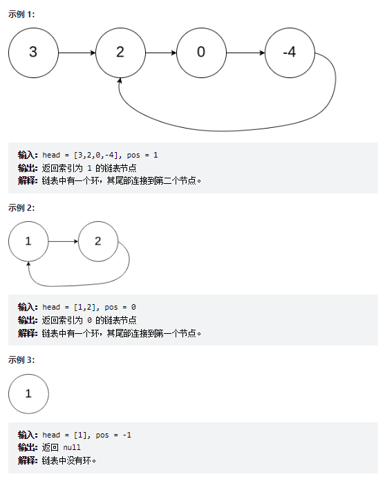
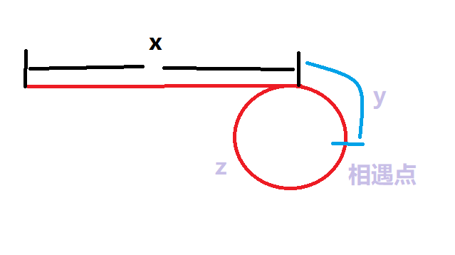
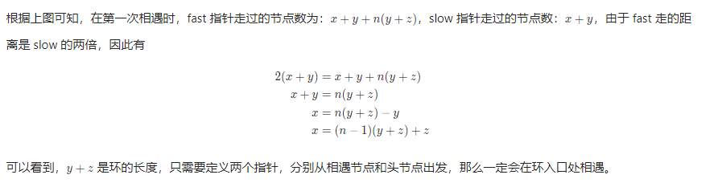

# 题目
给定一个链表的头节点  head ，返回链表开始入环的第一个节点。 如果链表无环，则返回 null。

如果链表中有某个节点，可以通过连续跟踪 next 指针再次到达，则链表中存在环。 为了表示给定链表中的环，评测系统内部使用整数 pos 来表示链表尾连接到链表中的位置（索引从 0 开始）。如果 pos 是 -1，则在该链表中没有环。注意：pos 不作为参数进行传递，仅仅是为了标识链表的实际情况。

不允许修改 链表。



# coding
```java
/**
 * Definition for singly-linked list.
 * class ListNode {
 *     int val;
 *     ListNode next;
 *     ListNode(int x) {
 *         val = x;
 *         next = null;
 *     }
 * }
 */
public class Solution {
    /**
        数学归纳法 + 快慢指针
     */
    public ListNode detectCycle(ListNode head) {
        // 判断是否成环
        ListNode node = isCircle(head);
        if(node == null){
            return node;
        }
        while(node != head){
            node = node.next;
            head = head.next;
        }
        return node;
    }

    // 判断并且返回相交的节点，无相交返回null
    public ListNode isCircle(ListNode head){
        ListNode fast = head;
        ListNode slow = head;

        while(fast != null && fast.next != null){
            fast = fast.next.next;
            slow = slow.next;
            if(fast == slow){
                return fast;
            }
        }
        return null;
    }
}

```

# 总结
1. 难点：在数学上进行归纳
2. 总体思路就是在判断到相遇点的时候，头节点和相遇点一起开始走，直到相遇，那么这个时候就是相遇的点了（数学公式如下）




