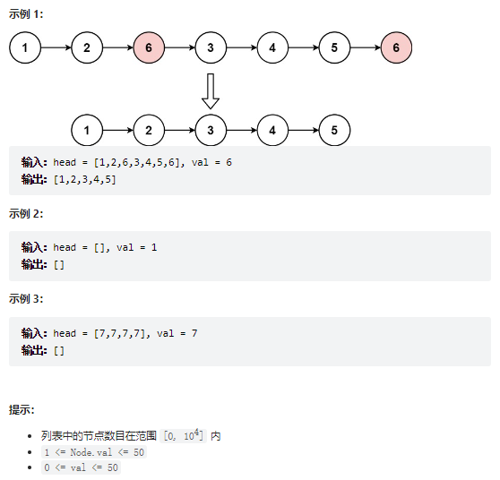
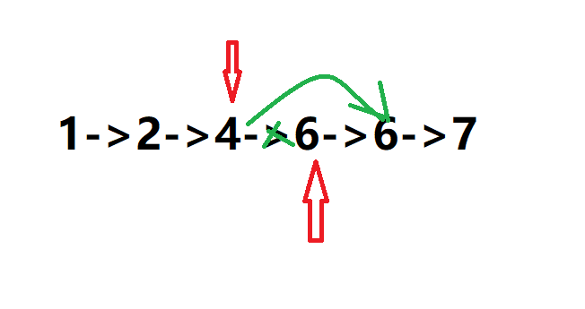

# 题目
给你一个链表的头节点 head 和一个整数 val ，请你删除链表中所有满足 Node.val == val 的节点，并返回 新的头节点 。


# coding
```java
/**
 * Definition for singly-linked list.
 * public class ListNode {
 *     int val;
 *     ListNode next;
 *     ListNode() {}
 *     ListNode(int val) { this.val = val; }
 *     ListNode(int val, ListNode next) { this.val = val; this.next = next; }
 * }
 */
class Solution {
    /**
        使用双指针
     */
    public ListNode removeElements(ListNode head, int val) {
        ListNode dummy = new ListNode(-1);
        dummy.next = head;
        ListNode pre = dummy;
        ListNode cur = dummy.next;
        while(cur != null){
            if(cur.val == val){
                // 相等的时候pre不需要往后走
                pre.next = cur.next;
            }else{
                // 不相等的时候才需要都向后面移动
                pre = pre.next;
            }     
            cur = cur.next;   
        }
        return dummy.next;
    }
}
```


# 总结
1. 不断的向后面去将目标值断键即可
2. 技巧
   1. 使用双指针和虚拟头节点

