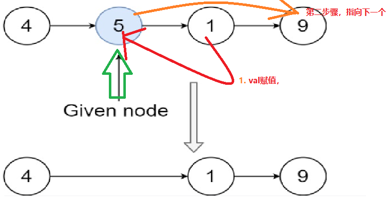

# 题目
有一个单链表的 head，我们想删除它其中的一个节点 node。

给你一个需要删除的节点 node 。你将 无法访问 第一个节点  head。

链表的所有值都是 唯一的，并且保证给定的节点 node 不是链表中的最后一个节点。

删除给定的节点。注意，删除节点并不是指从内存中删除它。这里的意思是：

给定节点的值不应该存在于链表中。
链表中的节点数应该减少 1。
node 前面的所有值顺序相同。
node 后面的所有值顺序相同。
自定义测试：

对于输入，你应该提供整个链表 head 和要给出的节点 node。node 不应该是链表的最后一个节点，而应该是链表中的一个实际节点。
我们将构建链表，并将节点传递给你的函数。
输出将是调用你函数后的整个链表。


# coding

```java
/**
 * Definition for singly-linked list.
 * public class ListNode {
 *     int val;
 *     ListNode next;
 *     ListNode(int x) { val = x; }
 * }
 */
class Solution {
    public void deleteNode(ListNode node) {
        // 当前节点的下一个节点
        ListNode next = node.next;
        // val赋值，地址还在
        node.val = next.val;
        // 指向删除点的下一个节点
        node.next = next.next;
    }
}
```

# 总结
1. 不知道头节点，难点保存原来的内存地址（就是评论中的要删却不删，tmd什么删不删）
2. 步骤如下
   1. 赋值（那么内存地址是不会变得【所以是没删】）
   2. 指向下一个节点，其实删得是目标节点的下一个节点内存地址，但是下一个val赋值给了目标节点
