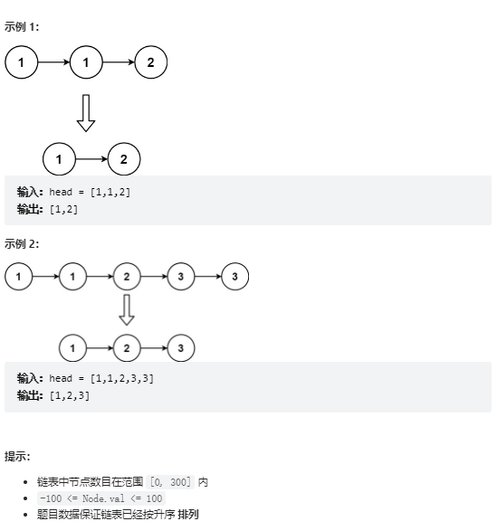

# 题目
给定一个已排序的链表的头 head ， 删除所有重复的元素，使每个元素只出现一次 。返回 已排序的链表 。


# coding
```java
/**
 * Definition for singly-linked list.
 * public class ListNode {
 *     int val;
 *     ListNode next;
 *     ListNode() {}
 *     ListNode(int val) { this.val = val; }
 *     ListNode(int val, ListNode next) { this.val = val; this.next = next; }
 * }
 */
class Solution {
    // 使用双指针，快慢指针
    public ListNode deleteDuplicates(ListNode head) {
        if(head == null || head.next == null){
            return head;
        }
        ListNode dummy = new ListNode(-10);
        dummy.next = head;
        ListNode fast = dummy.next;
        ListNode slow = dummy;
        while(fast != null){
            if(fast.val == slow.val){
                while(fast.val == slow.val){ 
                    fast = fast.next;
                    if(fast == null){
                        break;
                    }
                }
                slow.next = fast;
                slow = fast;
                if(fast != null){
                    fast = fast.next;
                }              
            }else{
                slow = fast;
                fast = fast.next;
            }
            
        }
        return dummy.next;

    }
}
```

# 总结

1. 快慢指针
2. 虚拟头节点


